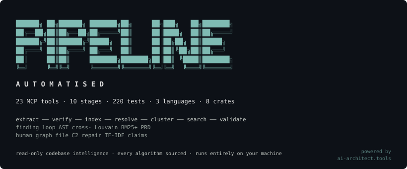

<!-- mcp-name: io.github.cdeust/ai-architect-mcp-codebase -->

<p align="center">
  
</p>

<p align="center">
  <a href="LICENSE"></a>
  
  
  
  
  <a href="https://www.bestpractices.dev/projects/13845"></a>
  
  
</p>

<p align="center">
  <strong>Cross-platform codebase intelligence for Codex, Gemini CLI, Claude Code, Cursor, VS Code, Zed, and any stdio MCP host.</strong><br>
  One read-only Rust server, host-specific installation packages, and the same evidence-graded graph answers everywhere.
</p>

<p align="center">
  <a href="#what-an-agent-can-ask-it">What An Agent Can Ask</a> · <a href="#getting-started">Getting Started</a> · <a href="#the-pipeline">Pipeline</a> · <a href="#26-mcp-tools">Tools</a> · <a href="#architecture">Architecture</a> · <a href="#the-zetetic-standard">Zetetic Standard</a>
</p>

<p align="center">
  <strong>Companion projects:</strong><br>
  <a href="https://github.com/cdeust/Cortex">Hypermnesia MCP</a> — persistent memory that consolidates and reconsolidates across sessions<br>
  <a href="https://github.com/cdeust/zetetic-team-subagents">zetetic-team-subagents</a> — 97 genius reasoning agents + 18 team specialists<br>
  <a href="https://github.com/cdeust/ai-architect-mcp-spec">AI Architect Spec</a> — TypeScript PRD generator that consumes our graph intelligence
</p>

---

Every AI coding assistant hits the same wall: you ask it to change `handle_tool_call`, and it either hallucinates a function that was renamed last week, edits something in the wrong community of the codebase, or silently breaks a call chain three modules away. Agents operate on strings; codebases have structure. The gap is where bugs live.

**ai-architect-mcp-codebase** is a cross-platform Rust MCP server for Codex, Gemini CLI, Claude Code, Cursor, VS Code, Zed, and other stdio MCP hosts. It indexes any Rust, Python, TypeScript, Java, Kotlin, Swift, Objective-C, C, C++, or Go codebase into a LadybugDB property graph (Ruby is dispatched on the shallow path — node-kind rows, no deep extraction — for 11 languages in total), resolves imports and call chains across files, detects functional communities via Leiden-class community detection, traces execution flows from entry points, builds a hybrid BM25 + sparse TF-IDF + RRF search index, and exposes all of it through 26 MCP tools.

It is the **codebase intelligence layer** that sits between a finding ("this bug exists") and a PRD ("here is the fix, here is what it affects, here is what it must never break"). It is **read-only intelligence** — it never writes code, opens PRs, or runs CI. It tells the system what is true about the code so the next stage can reason without guessing.

**One pipeline stage = one MCP tool. 10 stages. 26 tools. 12,000+ lines of Rust. 1500+ tests. Zero warnings. Every constant sourced.**

---

## What an agent can ask it

For inferred Rust receiver calls, pass `lsp: true` to `analyze_codebase` and
install rust-analyzer. The response's `lsp_status.state` distinguishes
`disabled`, `completed`, and `failed`; failures retain their error and analysis
continues on the available graph, which may contain partial LSP results.
`lsp_resolve` retains the pass's counts; `resolve.phase = "static"` identifies
the separate static-resolution receipt. Completion does not mean every call
was resolved.

Analysis persists its coverage report for `query_graph(graph="missed")` and
returns the same summary. Rust processes use explicit `#[test]` and
`#[kani::proof]` attributes, with separate `test` and `proof` entry kinds.
These are source declarations, not evidence of execution or successful proof.
([Rust testing attributes](https://doc.rust-lang.org/reference/attributes/testing.html),
[Kani proof attributes](https://model-checking.github.io/kani/reference/attributes.html).)
Graphs created before entry metadata was stored require a full reindex:
`analyze_codebase` rebuilds them, and `index_codebase` automatically falls back
to a full index when its incremental compatibility check detects the old schema.

```
analyze_codebase(path: "/path/to/project", output_dir: "/tmp/run")
  → index + resolve + cluster + build search index in one call
  → 430 nodes, 400 edges, 216 communities, 35 processes on our own codebase

search_codebase(graph_path, query: "process incoming tool requests")
  → hybrid ranked results: BM25 lexical + sparse TF-IDF semantic + RRF fusion
  → returns: handle_tool_call (score 0.021), dispatch_request (0.020), ...

get_context(graph_path, qualified_name: "src/main.rs::handle_tool_call")
  → 360° view: community membership, process participation,
    incoming calls, outgoing calls, types used, types that use it
  → did-you-mean suggestions when the symbol isn't found exactly

get_impact(graph_path, qualified_name)
  → blast radius: every process that transits this symbol, every community it touches
  → the answer to "what breaks if I change this?"

detect_changes(graph_path, diff_text OR base_ref+head_ref)
  → git diff → affected symbols → impacted communities → touched processes
  → risk score for the change

validate_prd_against_graph(prd_path, graph_path)
  → does the PRD reference real symbols? (symbol hallucination check)
  → does "scoped to X" match the actual community count?
  → does "doesn't affect main" hold against the call graph?

check_security_gates(graph_path, changed_symbols)
  → auth-critical community touch · unsafe symbol · public API change ·
    unresolved imports · test coverage gap

verify_semantic_diff(before_graph_path, after_graph_path)
  → what nodes/edges appeared, what disappeared, what dangles,
    new cycles via Tarjan SCC, regression score with verdict
```

---

## Getting started

### Prerequisites

- Rust 1.95.0 — pinned by [`rust-toolchain.toml`](rust-toolchain.toml), so `rustup` installs and selects it for you; the same compiler builds CI and the releases
- CMake (LadybugDB builds its C++ core from source — ~5 minutes first build, cached after)

### Clone + build

```bash
git clone https://github.com/cdeust/ai-architect-mcp-codebase.git
cd ai-architect-mcp-codebase
cargo build --release
# First build: ~5 minutes (compiles LadybugDB C++ core)
# Subsequent builds: <1 second incremental
```

### Register the MCP server

The repo ships a `.mcp.json` that Claude Code picks up automatically when you open the directory:

```json
{
  "mcpServers": {
    "ai-architect": {
      "command": "cargo",
      "args": ["run", "--quiet", "--release", "--manifest-path", "Cargo.toml", "--", "--profile", "core"]
    }
  }
}
```

Or register globally (recommended agent setup — the `core` profile):

```bash
claude mcp add ai-architect -- /absolute/path/to/target/release/ai-architect-mcp-codebase --profile core
```

### Tool profiles

The server registers one of two tool sets, chosen once at startup:

| Profile | Tools | Who it's for |
|---|---|---|
| `core` | 8 — `health_check` · `analyze_codebase` · `search_codebase` · `get_context` · `get_symbol` · `get_impact` · `query_graph` · `detect_changes` | **Recommended for agents.** The read-only code-intelligence surface: analyze once, then search, inspect symbols, and measure blast radius. |
| `full` | all 26 | The ai-architect pipeline orchestrator — adds the internal finding → PRD stages (1/2/4/6/8/9) and the manual graph passes (`index_codebase`, `resolve_graph`, `cluster_graph`, `lsp_resolve`, `get_processes`, `index_history`). |

Select with the `--profile` flag or the `AP_PROFILE` environment variable (the flag wins):

```bash
ai-architect-mcp-codebase --profile core   # agent-facing 8
AP_PROFILE=core ai-architect-mcp-codebase  # same, via env
ai-architect-mcp-codebase                  # default: full (all 26)
```

The default stays `full` until the next major version — shrinking the default tool surface is a breaking change. New agent installations should opt into `core`: `analyze_codebase` already runs index + resolve + cluster in one call, so the 18 hidden tools are pipeline plumbing an agent never needs, and hiding them keeps the tool prompt small.

### First run

```bash
# Run the binary directly to verify the handshake
./target/release/ai-architect-mcp-codebase

# Or exercise it via stdio JSON-RPC:
printf '%s\n' \
  '{"jsonrpc":"2.0","id":1,"method":"initialize","params":{}}' \
  '{"jsonrpc":"2.0","id":2,"method":"tools/list"}' \
  '{"jsonrpc":"2.0","id":3,"method":"tools/call","params":{"name":"health_check","arguments":{}}}' \
  | ./target/release/ai-architect-mcp-codebase
```

### Use with other MCP hosts

The server is a self-contained stdio binary — any MCP host can launch it. Install once:

```bash
cargo install ai-architect-mcp-codebase   # installs the `ai-architect-mcp-codebase` binary into ~/.cargo/bin
```

### Install into your agent host (auto-config)

One command detects your installed hosts and writes the right MCP config for each — **never clobbering** the rest of the file:

```bash
ai-architect-mcp-codebase install
```

It configures the top six hosts it detects: **Claude Code** (`~/.claude.json`), **Codex CLI** (`~/.codex/config.toml`), **Gemini CLI** (`~/.gemini/settings.json`), **Cursor** (`~/.cursor/mcp.json`), **VS Code** (`Code/User/mcp.json`), and **Zed** (`~/.config/zed/settings.json`).

- **Never clobbers.** The existing config is parsed; only our `ai-architect` entry is added or updated; every other server survives. A file it cannot safely parse is **never overwritten** — it prints the exact entry to paste by hand.
- **Zed JSONC.** Zed's `settings.json` allows comments, which strict JSON editing would destroy, so `install` **refuses to edit it in place** and prints the snippet + instructions instead (your comments stay byte-for-byte).
- **Codex TOML** is edited comment- and format-preserving (via `toml_edit`).
- **Flags:** `--dry-run` (print planned changes, write nothing), `--only <host>` / `--skip <host>` (filter; `--only` forces a host even if undetected), `--with-hooks` (also register the Grep/Glob PreToolUse hook, see below). Re-running is **idempotent** (a second run reports "no change").
- **Uninstall:** `ai-architect-mcp-codebase uninstall` removes exactly our entries (and the hook), leaving everything else intact.

```bash
ai-architect-mcp-codebase install --dry-run                 # preview
ai-architect-mcp-codebase install --only cursor --only zed  # just these
ai-architect-mcp-codebase install --with-hooks              # + the grep→graph hook
ai-architect-mcp-codebase uninstall                         # remove our entries
```

**Binary → first query.** Measured on this machine (2026-07): `install` completes in **~1.3 s** (dominated by process/DB startup; the config write itself is sub-second); `analyze_codebase` on this repo's own `src/` (114 files → 16.5k nodes, 16.3k edges — index + resolve + cluster) takes **~12 s wall**; the first `search_codebase` returns instantly. So once the binary exists, **install → analyze → first graph query is ~15 s — well under the 2-minute target.** The one-time `cargo build --release` (~5 min, compiling the LadybugDB C++ core) is a separate, before-the-clock step.

#### Fail-open grep→graph hook

`ai-architect-mcp-codebase install --with-hooks` registers a Claude Code `PreToolUse` hook (matcher `Grep|Glob`) that runs `ai-architect-mcp-codebase hook-augment`. Before a Grep/Glob in a project that has an ai-architect graph, it injects a one-line suggestion to consider `search_codebase`/`query_graph` first. **Cardinal rule: it never blocks the tool call** — no graph, an unparseable payload, or any error → it prints nothing and exits 0. Hook registration is **opt-in** (the `--with-hooks` flag), never default.

### Or configure a host by hand

The CLI commands below assume `~/.cargo/bin` is on your `PATH`. GUI hosts (Cursor, Windsurf, VS Code) may not inherit your shell `PATH` — in the JSON configs, replace `ai-architect-mcp-codebase` with the output of `which ai-architect-mcp-codebase`. Use the `core` profile (8 read-only tools) for agent hosts.

**Gemini CLI**

```bash
gemini mcp add -e AP_PROFILE=core ai-architect ai-architect-mcp-codebase
```

Or install as an extension (this repo ships a `gemini-extension.json`):

```bash
gemini extensions install https://github.com/cdeust/ai-architect-mcp-codebase
```

The extension also exposes three host-native workflows from `skills/`:
`understand-codebase`, `impact-analysis`, and `validate-change-plan`.
They use only the eight tools in the `core` profile and explicitly surface
index coverage gaps before accepting negative graph results.

**Claude Code plugin** (primary interface)

```bash
claude plugin marketplace add cdeust/ai-architect-mcp-codebase
claude plugin install ai-architect-mcp-codebase@ai-architect-mcp-codebase-marketplace
```

Fresh marketplace installs require GitHub CLI 2.68 or newer. The bootstrap
verifies the release's attached Sigstore bundle against the fixed
`cdeust/ai-architect-mcp-codebase/.github/workflows/release.yml` signer before
installing any executable; it never accepts a manifest-provided trust anchor.
The bundle avoids a Rekor transparency-log lookup, but `gh` can still need the
network to refresh Sigstore's TUF trust root on a cold cache.
This protects the official package and makes a minimal-diff fork that changes
only metadata fail closed; it cannot make arbitrary code from a hostile fork
trustworthy, because such a fork can also replace the bootstrap itself. Verify
that the marketplace slug is exactly `cdeust/ai-architect-mcp-codebase`.

#### Developer escape hatch: running a local dev build in place of the release

`bin/ensure-binary.sh` pins the installed binary to a verified release digest
(see [Security](#security)) — that pin rejects any binary it did not download
and verify itself, including one you legitimately rebuilt from source. Set
`AI_ARCHITECT_SOURCE_CHECKOUT=1` to opt out of the pin for a local dev build.
The bootstrap accepts two shapes under this flag, both requiring the explicit
opt-in — it is never inferred from metadata:

- **Plain source checkout** — `$CLAUDE_PLUGIN_ROOT` itself contains `.git`
  (you registered a clone directly as the plugin root).
- **Live-mount montage** — the installed binary at
  `target/release/ai-architect-mcp-codebase` is a symlink whose fully
  resolved target lies outside `$CLAUDE_PLUGIN_ROOT` and sits inside its own
  `.git`-bearing checkout (e.g. a marketplace cache whose binary was replaced
  with a symlink into a separate dev clone, so you can iterate without
  reinstalling the plugin after every rebuild). Added in
  [#208](https://github.com/cdeust/ai-architect-mcp-codebase/pull/208) —
  a plain `.git`-at-root check cannot see this shape, because a marketplace
  cache has no `.git` of its own.

**What the flag skips, precisely:** only the release-binary digest
verification (`sha256sum` against the cached/pinned digest) and, for a fresh
install, the download + Sigstore provenance check — for that one launch. It
does **not** skip the `Cargo.toml` / `plugin.json` presence checks (still
`fatal` if either file is missing), and for a plain source checkout it still
runs the freshness rebuild (`cargo build --release` when `src/` is newer than
the binary). For the montage shape specifically, nothing rebuilds the
binary — the bootstrap trusts the already-built binary the symlink resolves
to, as-is.

**Threat model.** This is an explicit, user-set opt-in, never something
packaged metadata can trigger. An attacker who can already write to your
plugin cache — replacing the installed binary with a symlink to force this
path — can just as easily replace `bin/ensure-binary.sh` or
`bin/launch-plugin.sh` themselves, so the digest pin was never a defense
against that attacker; it defends the *default* path (flag unset) where the
bootstrap is the thing standing between a marketplace download and your
shell. The default path is unchanged by this hatch and remains a hard
`fatal` on any digest mismatch. Every accepted bypass is announced on
`stderr` even in quiet mode:

```
ai-architect-mcp-codebase: bootstrap verification skipped (source-checkout mode)
ai-architect-mcp-codebase: live-mounted dev symlink: <plugin-cache>/target/release/ai-architect-mcp-codebase -> <resolved dev path> (source checkout at <resolved .git root>)
```

**Diagnosing the failure mode without the flag.** If a marketplace-cache
binary is replaced by a montage symlink and `AI_ARCHITECT_SOURCE_CHECKOUT` is
not set, the plugin dies silently from Claude Code's point of view — you only
see `MCP error -32000: Connection closed`. The real cause is on stderr, which
Claude Code does not surface for a failed MCP launch; run the launcher by
hand with `CLAUDE_PLUGIN_ROOT` set to the plugin cache directory to see it:

```bash
CLAUDE_PLUGIN_ROOT=/path/to/plugin/cache bin/launch-plugin.sh
# ai-architect-mcp-codebase: FATAL: cached binary digest mismatch; reinstall the plugin
```

**Operational gotcha:** `export AI_ARCHITECT_SOURCE_CHECKOUT=1` in
`~/.zshrc` alone is not enough. `~/.zshrc` is read only by *interactive*
shells; the Claude Code plugin launcher and its hooks run in non-interactive
ones and never see it. Put the export in `~/.zshenv` (or your shell's
equivalent non-interactive startup file) instead.

If the former Automatised Pipeline plugin is installed, remove it before
installing the canonical package:

```bash
claude plugin uninstall automatised-pipeline@automatised-pipeline-marketplace
claude plugin marketplace remove automatised-pipeline-marketplace
```

Claude MCP allowlists and permissions must also replace every prefix listed in
`revoked_claude_tool_prefixes` in the contract with
`mcp__plugin_ai-architect-mcp-codebase_ai-architect__<tool>`. The final
`ai-architect` segment is intentionally stable: it is the MCP server key, not
the plugin's distribution name. The machine-readable source of truth is
[`mcp-contract.json`](mcp-contract.json); consumer repositories validate their
allowlists against its derived `claude_tool_prefix` instead of maintaining an
independent spelling.

Contract schema 1 requires `distribution`, `claude_plugin`,
`claude_marketplace`, `mcp_server`, `claude_tool_prefix`, and
`revoked_claude_tool_prefixes`. Consumers must pin the raw contract URL to the
full commit SHA (tags can be moved), validate that the prefix equals
`mcp__plugin_<claude_plugin>_<mcp_server>__`, and remove revoked prefixes from
allowlists rather than retaining them as aliases. Consumer PRs record the full
producer commit in their contract URL; the v0.11.1 release must not be assumed
available until its verified-release workflow completes.
The same contract is included in the crate, MCPB, and signed release assets.

**OpenAI Codex CLI** (also picked up by the ChatGPT desktop app and Codex IDE extension — they share `~/.codex/config.toml`)

```bash
codex mcp add ai-architect -- ai-architect-mcp-codebase --profile core
```

Or in `~/.codex/config.toml`:

```toml
[mcp_servers.ai-architect]
command = "ai-architect-mcp-codebase"
args = ["--profile", "core"]
```

Or install the packaged Codex plugin and its three matching skills from this
repository's marketplace:

```bash
cargo install ai-architect-mcp-codebase
codex plugin marketplace add cdeust/ai-architect-mcp-codebase
codex plugin add ai-architect-mcp-codebase@ai-architect-mcp-codebase
```

The Codex package lives under `plugins/ai-architect-mcp-codebase/`, with its own
`.mcp.json` fixed to `--profile core`. This isolation is intentional: the
root `.mcp.json` remains the existing Claude project configuration and keeps
the server's backward-compatible `full` default.

For Gemini CLI, uninstall the former extension identity before reinstalling
from the renamed repository:

```bash
gemini extensions uninstall ai-architect
gemini extensions install https://github.com/cdeust/ai-architect-mcp-codebase
```

**Cursor** — `.cursor/mcp.json` (project) or `~/.cursor/mcp.json` (global):

```json
{
  "mcpServers": {
    "ai-architect": {
      "command": "ai-architect-mcp-codebase",
      "args": ["--profile", "core"]
    }
  }
}
```

**Windsurf** — `~/.codeium/windsurf/mcp_config.json`: same `mcpServers` block as Cursor.

**VS Code** — `.vscode/mcp.json`:

```json
{
  "servers": {
    "ai-architect": {
      "type": "stdio",
      "command": "ai-architect-mcp-codebase",
      "args": ["--profile", "core"]
    }
  }
}
```

**OpenAI Agents SDK (Python)**

```python
from agents.mcp import MCPServerStdio

async with MCPServerStdio(
    name="ai-architect",
    params={"command": "ai-architect-mcp-codebase", "args": ["--profile", "core"]},
) as server:
    agent = Agent(name="Assistant", mcp_servers=[server])
```

---

## The pipeline

Every stage is a tool. Stages build on each other but are independently callable. The pipeline is serial in logical order but MCP calls are stateless — you can re-run stages 3a-3d on a fresh codebase without re-running stages 1-2.

| # | Tool(s) | What it does |
|---|---|---|
| **0** | `health_check` | Handshake + protocol + tool count |
| **1** | `extract_finding`, `refine_finding` | Deterministic finding extraction + orchestrator-aware prompt refinement |
| **2** | `start_verification`, `append_clarification`, `finalize_verification`, `abort_verification` | Human-gated clarification loop with SHA-256 transcript digest, atomic single-file session state |
| **3a** | `index_codebase`, `query_graph`, `get_symbol` | tree-sitter AST → LadybugDB graph (16 node labels, 36+ relationship tables); user-configurable `exclude_dirs` and graceful skip of unreadable directories (issue #249) |
| **3b** | `resolve_graph`, `lsp_resolve` | Import/call/impl resolution with confidence scoring + optional LSP deep resolution (rust-analyzer / pyright / typescript-language-server) |
| **3c** | `cluster_graph`, `get_processes`, `get_impact` | Leiden-class community detection (Louvain + C2 repair) + BFS execution-flow tracing from entry points |
| **3d** | `search_codebase`, `get_context`, `analyze_codebase`, `detect_changes` | Hybrid BM25 + sparse TF-IDF + RRF search · 360° symbol view · all-in-one analysis · git-diff impact |
| **4** | `prepare_prd_input` | Bundle verified finding + graph intel → artifact for ai-architect-mcp-spec |
| **6** | `validate_prd_against_graph` | Symbol hallucination · community consistency · process-impact contradiction |
| **8** | `check_security_gates` | Auth-critical community · unsafe symbol · public-API change · unresolved-import intro · test-coverage gap |
| **9** | `verify_semantic_diff` | Before/after graph diff with Tarjan SCC cycle detection and regression scoring |

> Stages 5 (PRD generation), 7 (implementation), 10 (benchmark), 11 (deployment), 12 (PR) belong to other systems in the pipeline: [ai-architect-mcp-spec](https://github.com/cdeust/ai-architect-mcp-spec), the coding agent, CI, and `gh`. This project is the **read-only intelligence** half.

---

## 26 MCP Tools

Every tool takes structured JSON arguments via the MCP protocol and returns a structured JSON response. No LLM is called from inside any tool — intelligence is the agent's job; the tool's job is safe, fast data movement with invariants.

```
Stage 0:  health_check
Stage 1:  extract_finding · refine_finding
Stage 2:  start_verification · append_clarification · finalize_verification · abort_verification
Stage 3:  ingest_traces
Stage 3a: index_codebase · index_status · query_graph · get_symbol
Stage 3b: resolve_graph · lsp_resolve
Stage 3c: cluster_graph · get_processes · get_impact
Stage 3d: search_codebase · get_context · analyze_codebase · detect_changes
Stage 3e: index_history
Stage 4:  prepare_prd_input
Stage 6:  validate_prd_against_graph
Stage 8:  check_security_gates
Stage 9:  verify_semantic_diff
```

Each tool has a JSON Schema enforced at the wire, reason codes on error (no cryptic protocol errors), and a receipt-style response with timing and counts.

> Agent installs rarely need all 26 — the `core` profile (see [Tool profiles](#tool-profiles)) registers just the 8 code-intelligence tools.

### Team-shared graph artifact (optional)

`index_codebase` can commit a compressed snapshot of the graph so teammates who
clone the repo never have to cold-index it.

- `index_codebase` with `"export_artifact": true` writes, after a successful
  index, a `tar → zstd` snapshot to `<path>/.ai-architect-mcp-codebase/graph.zst`
  plus a `graph.meta.json` sidecar (schema version, git sha, tool version,
  node/edge counts). It also appends a `.gitattributes` entry
  (`.ai-architect-mcp-codebase/graph.zst binary merge=ours`) so the committed
  binary never produces merge conflicts across branches. Commit both files.
  A repo indexed before the project rename (issue #195) carries this snapshot
  under the old `.automatised-pipeline/` directory name; the first touch of
  the artifact (export, bootstrap, or even a `hook-augment` Grep/Glob check)
  migrates it to the current name in place — a one-shot rename, not a
  permanent dual-path read.
- `index_codebase` with `"bootstrap": true` — when there is no local graph at
  `<output_dir>/graph` but a committed artifact is present — decompresses the
  snapshot instead of cold-indexing. **Staleness is checked first** by comparing
  the artifact's git sha with the repo's current HEAD:
  - shas equal → import as-is (nothing to fill), response `source='artifact_bootstrap'`,
    `graph_state='fresh'`;
  - shas differ → by **default the snapshot is imported, then incrementally
    filled** up to the working tree (only the artifact→HEAD diff is
    re-parsed), response `source='artifact_bootstrap_fill'`,
    `graph_state='filled_to_working_tree'`, carrying `fill_method` and
    `{changed, added, deleted, renamed, unchanged}` counts;
  - `"accept_stale": true` → import the stale snapshot anyway and **skip the
    fill**, and the response carries a `stale_artifact`
    `{artifact_sha, head_sha, commits_behind}` report so a stale graph is
    never mistaken for a fresh one.

  A fill that fails (no git diff and no bundled manifest) falls back to a
  full index, as does an import failure — both explicit (logged to stderr,
  never a silent partial graph) and reported via a `bootstrap_skipped` note.

### Excluding directories from the walk (issue #249)

Both `index_codebase` and `analyze_codebase` accept `"exclude_dirs"`
(default `[]`) — directory names or paths to prune from the walk in
addition to the built-in build/dependency skip list (`node_modules`,
`.venv`, `vendor`, `target`, …). This is for directories that must never be
read (a secrets folder, a credentials mount), not a performance prune:

- An entry **without** a path separator (e.g. `"secrets"`) is a bare name,
  matched anywhere in the tree — like the built-in list.
- An entry **with** a path separator (e.g. `"config/secrets"`) is a path
  relative to `path`, matched as exactly one subtree. No glob support.
- Exclusion **wins over every `dependency_scope` tier**, including `full` —
  it is checked before, and independently of, dependency-directory descent.
- Pruned directories are never silently dropped: each appears in the
  coverage sidecar as `skipped` with reason `user_excluded`, and the
  response's `coverage.skipped.user_excluded_count` carries the exact count.
- Changing `exclude_dirs` on an existing graph requires `"full": true` — like
  `dependency_scope`, the incremental-index manifest does not capture it.

Independent of `exclude_dirs`, a directory the OS refuses to read
(`EACCES`/`PermissionDenied`) no longer aborts the whole index: it is
recorded in the coverage sidecar with reason `unreadable` and the walk
continues past it, so one locked-down subdirectory can no longer discard an
otherwise-successful index.

All three flags default to `false`, so existing behavior and the `core`/`core8`
profiles are unchanged. The artifact is entirely optional: without it,
`index_codebase` cold-indexes exactly as before.

> Post-import *incremental fill* (re-index only the `artifact_commit..HEAD` diff
> instead of a full re-index) is tracked in
> [#62](https://github.com/cdeust/ai-architect-mcp-codebase/issues/62) — it needs a
> changed-files-only indexer, which AP does not yet have.

---

## Architecture

Rust MCP server, hand-rolled stdio JSON-RPC 2.0 (no SDK — we own the wire). Clean Architecture with module boundaries.

```
transport (stdio, JSON-RPC framing)
      ↓
server/main.rs  (request dispatch, tool registry)
      ↓
handlers (do_* functions, one per tool)
      ↓
core modules:
    graph_store        — LadybugDB port (Cypher + UNWIND + prepared statements)
    parser/{rust,python,typescript,mod}  — tree-sitter AST extractors
    indexer            — walk + parse + persist pipeline
    resolver           — cross-file import/call/impl resolution
    lsp_{client,resolver}  — optional LSP deep resolution
    clustering         — inline Louvain + C2 repair + process tracing
    search/{bm25,vector,rrf,mod}  — hybrid search (Tantivy + sparse TF-IDF + RRF)
    prd_input          — stage 4: bundle for ai-architect-mcp-spec
    prd_validator      — stage 6: validate PRD claims against graph
    security_gates     — stage 8: auth/unsafe/API/imports/coverage checks
    semantic_diff      — stage 9: before/after graph regression scoring
    git_diff           — diff parser + symbol mapping
```

### Dependencies

Sixteen crates. Nothing speculative; everything justified.

| Crate | Purpose | License | Why |
|---|---|---|---|
| `serde` + `serde_json` | Wire serialization | MIT | JSON-RPC, artifact persistence |
| `sha2` | Stage-2 transcript digest | MIT | Tamper detection |
| `lbug` (LadybugDB) | Embedded property graph + Cypher | MIT | Native Cypher, FTS-ready, the Kùzu successor |
| `tree-sitter` | Incremental parser runtime | MIT | First-class Rust bindings |
| `tree-sitter-rust` · `-python` · `-typescript` · `-java` · `-kotlin-ng` · `-swift` · `-objc` · `-c` · `-cpp` · `-go` | Language grammars (10) | MIT / Apache-2.0 | Semantic structure without a compiler |
| `tantivy` | Lucene-grade BM25 | MIT | Real ranked text search, <10ms startup |

Deliberately **not** included: async runtime (we're stdio-blocking), HTTP client, LLM SDK, embedding model runtime (sparse TF-IDF replaces it at zero dep cost).

### Storage

Graphs are per-finding by design (Lamport's isolation invariant): each finding gets its own LadybugDB instance at `<output_dir>/runs/<run_id>/findings/<finding_id>/graph/`. Zero-coordination concurrency, trivial cleanup, no cross-finding state leakage. Redundant indexing for shared codebases is acknowledged and mitigated in a later optional cache layer — not shoehorned into the core.

### Configuration — `max_db_size`

Every LadybugDB `Database` this crate opens reserves virtual address space up front, sized by `max_db_size`. lbug's own default (`SystemConfig::default()`) is `1 << 43` = 8 TiB per instance; with `graph_cache`'s `MAX_CACHED_GRAPHS = 8` entries live in the read-path cache at once, that is a 64 TiB worst case (issue #25). `src/graph_store.rs::system_config()` is the single choke point every `GraphStore::open_or_create` call resolves through, in this precedence order:

1. **`AP_LBUG_TEST_MAX_DB_SIZE`** — test-only, set for every `cargo test` process via `.cargo/config.toml`'s `[env]` table (512 MiB / `2^29`, issue #21). Always wins when present, so `cargo test` behavior is independent of the production knob below.
2. **`AP_LBUG_MAX_DB_SIZE`** — production override, unset by default. Bytes, must be a power of two and at least 8 MiB (lbug's own `BufferManager::verifySizeParams` floor). An invalid value is rejected with an actionable error at `GraphStore::open_or_create` time — never a silent fallback.
3. **Default: 8 TiB (`1 << 43` bytes)** when neither var is set — lbug's own `DEFAULT_VM_REGION_MAX_SIZE`, the engine's per-database VM-region ceiling on every 64-bit desktop/server platform (`lbug-0.19.1/lbug-src/src/include/common/constants.h`). This is an address-space **reservation**, not an allocation: disk and memory grow only with the data actually written. An earlier release capped the default at 8 GiB (issue #25, sized from the measurement table below); that cap **aborted any ingestion whose graph outgrew it** and was repealed on 2026-08-14 — an index must complete regardless of corpus size, multi-TiB included.

Set `AP_LBUG_MAX_DB_SIZE` to bound the reservation in address-space-constrained environments (e.g. containers with a low `RLIMIT_AS`); the historical measurement table below documents typical graph sizes.

**Measured graph sizes (2026-07-15, `du -k` on every `graph` file found under `~/.cache/cortex/code-graphs/*/graph`, `~/.cortex/ap_graph/graph`, and `**/.prd-gen/graphs/*/graph`), top 10 of 75:**

| Graph | Size |
|---|---|
| `repro-cortex-viz-deps` (cortex-viz + `node_modules`) | 473 MiB |
| `bench-c2-viz-deps` (cortex-viz + deps) | 472 MiB |
| `bench-c3-viz-pubapi` (cortex-viz, public API surface) | 460 MiB |
| `wt-windows-launcher-96-97-*` (Cortex worktree) | 147 MiB |
| `wt-homeostatic-*` (Cortex worktree) | 144 MiB |
| `wt-tools-drift-*` (Cortex worktree) | 143 MiB |
| `Cortex-wt-wiki-titles-*` | 142 MiB |
| `wt-findings-provenance-*` | 126 MiB |
| `anthropic-partnership-Cortex` | 126 MiB |
| `wt-ingest-provenance-*` | 124 MiB |

Total across all 75 measured graphs: ~4.87 GiB. Every graph other than the top 3 (which include `node_modules`) is under 150 MiB — the `node_modules`-inclusive runs are the actual worst case driving the sizing rule above.

---

## The zetetic standard

Inherited from [zetetic-team-subagents](https://github.com/cdeust/zetetic-team-subagents). Not a prompt suggestion — an enforcement rule that holds in code.

| Pillar | Question |
|---|---|
| **Logical** | *Is it consistent?* |
| **Critical** | *Is it true?* |
| **Rational** | *Is it useful?* |
| **Essential** | *Is it necessary?* |

**In this codebase it concretely means:**

1. Every algorithm traces to a source. Louvain → *Blondel et al. 2008*. Leiden C2 repair → *Traag et al. 2019*. RRF → *Cormack, Clarke, Büttcher 2009*. SCC → *Tarjan 1972*. BM25 via Tantivy → *Robertson et al. 1994*.
2. Every named constant has a `// source:` comment. `RRF_K = 60` cites Cormack 2009. `BULK_BATCH_SIZE = 500` cites Kùzu/LadybugDB tuning. `PARSE_TIMEOUT_MICROS = 5_000_000` is justified in the block above it.
3. No invented numbers. Where a value was chosen by judgment, the comment says so ("heuristic, not paper-backed") and cites its operational justification.
4. Tool responses cite the spec that governs each error reason. `unsafe finding_id (spec §5.1.4, §9.3 Q4): must match [A-Za-z0-9._-]+` — callers see which rule they violated.
5. When a capability can't be proved at spec time, the tool degrades gracefully and says so in plain language. Example: `lsp_resolve` on a stub binary returns `lsp_probe_failed: found on PATH but didn't respond as an LSP server (stdout closed immediately; likely a stub, proxy, or non-LSP binary)` — not a cryptic protocol error.

---

## Security

Four CRITICAL, four HIGH, three MEDIUM findings were surfaced by a `security-auditor` agent pass and fixed in commit [`512d683`](https://github.com/cdeust/ai-architect-mcp-codebase/commit/512d683):

- Cypher injection via `insert_edge` → centralized `cypher_str()` escaping (`\` first, then `'`)
- Git argument injection → `validate_git_ref` rejects `--`, newlines, NUL; `--` separator before refs
- Arbitrary binary execution via `lsp_command` → strict allowlist (`rust-analyzer`, `pyright`, `pyright-langserver`, `typescript-language-server`)
- Symlink traversal → `fs::symlink_metadata` + `MAX_DEPTH`
- Resource exhaustion → `MAX_FILES=100_000`, `MAX_FILE_BYTES=10 MB`, `MAX_TOTAL_BYTES=2 GB`, `MAX_DEPTH=64`
- Tree-sitter pathological input → `set_timeout_micros(5_000_000)` + `MAX_PARSE_BYTES=1 MB`
- `query_graph` read-only → two layers over disjoint statement families (see below)
- `graph_path` filesystem safety → `validate_graph_path_safe()` before any `remove_dir_all`
- LSP `rootUri` → RFC 3986 percent-encoding
- Diff line overflow → `DIFF_LINE_MAX = u64::MAX / 2` guard

Each fix has a test that asserts the exploit is now rejected. Run `cargo test` to see 1500+ tests pass including the exploit-regression suite.

### How `query_graph` is kept read-only

Two layers, covering **disjoint** statement families. Neither subsumes the other.

| Layer | Refuses | Mechanism |
|---|---|---|
| Engine (`GraphStore::execute_read_only_query`) | every database write and DDL — `CREATE`, `MERGE`, `SET`, `DELETE`/`DETACH DELETE`, `DROP`, `ALTER`, however spelled | `PreparedStatement::is_read_only()`: the verdict comes from the compiled plan, so a mutation written in syntax no keyword scan enumerates is still refused |
| Lexical (`FORBIDDEN_CYPHER_KEYWORDS`) | filesystem and database movement — `COPY … TO`, `EXPORT`/`IMPORT DATABASE`, `ATTACH`, `DETACH`, `USE`, `LOAD FROM` | whole-word, case-insensitive scan of the query with string literals, backticked identifiers and comments masked out first |
| Lexical (`READ_ONLY_PROCEDURES`) | every `CALL` naming anything but `TABLE_INFO` / `SHOW_TABLES` — including the `CALL <setting> = <value>` configuration form | per-PROCEDURE classification of the identifier after each `CALL` token |

The lexical layer is **load-bearing, not defence in depth**. lbug's
`StatementReadWriteAnalyzer` overrides `visitCopyFrom` but leaves **six**
statements at the base visitor's no-op — `visitCopyTo`, `visitExportDatabase`,
`visitImportDatabase`, `visitAttachDatabase`, `visitDetachDatabase` and
`visitUseDatabase` (`parsed_statement_visitor.h`:51, 57-61 on lbug 0.19.1) — so all
six are classified read-only. `DETACH`/`USE` were added to the denylist on
2026-08-25 after a mechanical re-audit against those headers; before it, both
passed the lexical filter AND the engine filter. Measured 2026-08-24 against
lbug 0.19.1 on **both** available engine gates — `is_read_only()` and a database
opened with `SystemConfig::read_only(true)`, which reaches the same predicate via
`ClientContext::validateTransaction` — `COPY (…) TO 'f.csv'` and
`EXPORT DATABASE 'd'` execute and write the filesystem, while both correctly refuse
`CREATE NODE TABLE`. Pinned by `engine_gate_does_not_cover_filesystem_writes` and,
for the whole family, `engine_classifies_every_filesystem_statement_as_read_only`.

`CALL` is classified **per procedure** rather than refused wholesale, so schema
introspection (`CALL table_info('Function') RETURN *`) is reachable. That
distinction is load-bearing too: the same analyzer returns `readOnly = true` from
`visitStandaloneCall`, so `CALL threads = 8` — a configuration write — is
engine-read-only, and this lexical layer is the only barrier that exists against
it. Relaxing the KEYWORD rather than allowlisting the PROCEDURE would remove that
barrier entirely.

A keyword introduced by `:` or `.` is an identifier, not a clause, so queries over
this schema's own `Import` node table work unchanged:
`MATCH (f:File)-[:Defines_File_Import]->(n:Import) WHERE n.is_resolved = false RETURN n.path`.

The gate does **not** extend that exemption to an alias (`AS <keyword>`), where the
clause detectors do. The asymmetry is deliberate: on the gate an exemption can only
ever let a keyword through, so it fails closed and a bare `use`/`create` pattern
variable is refused (backtick it); on the clause detectors the expensive direction
is reversed, because reading `AS limit` as a clause would suppress the `LIMIT`
injection. A masked literal or backticked identifier is treated as a TOKEN, never
as whitespace, so no look-back can walk across one.

`query_graph` executes **one statement per call**. A trailing `;` is accepted; a
`;`-chained request is refused with reason `multi_statement_not_supported`, because
the read-only classification, `LIMIT` injection, `ORDER BY` detection and the offset
cursor are all properties of a single statement.

The full security argument — threat model, trust boundaries, what each claim
rests on, and where it stops — is in
[docs/ASSURANCE-CASE.md](docs/ASSURANCE-CASE.md). Reporting process and response
SLA: [SECURITY.md](SECURITY.md). How the project is run and what happens if the
maintainer stops: [GOVERNANCE.md](GOVERNANCE.md). Where it is going:
[docs/ROADMAP.md](docs/ROADMAP.md). OpenSSF Best Practices answers, criterion by
criterion: [.bestpractices.json](.bestpractices.json).

---

## Scale

Re-measured 2026-07-28 on the current dependency (`lbug 0.18`, rustc 1.95.0,
macOS 26.5.1 arm64) by re-running the `dba` agent's nine compile-and-run probes
— `cargo test --release --test lbug_bulk_investigation -- --nocapture`, 199
edges per strategy. The ranking is the same one the original 0.15.3 run found;
the absolute figures are not comparable across the two runs, because both the
engine version and the machine changed.

| Strategy | ms/edge |
|---|---|
| Raw string per edge (naive) | 9.658 |
| Prepared statement, no transaction | 6.924 |
| `BEGIN TRANSACTION` + prepared + `COMMIT` | 0.328 |
| **UNWIND + typed `LogicalType::Struct`** | **0.127** |

The chosen path is **76× faster than the naive one** on this measurement.

The bulk-insert path uses UNWIND with a typed struct schema (the engineer who wrote the first version used `LogicalType::Any` which fails the binder — the typed struct form works). Prepared statements are cached in a `RefCell<HashMap<query, PreparedStatement>>` on the `GraphStore`. Sparse TF-IDF replaces the dense `N × V × 4B` matrix — **30.5× smaller** on our own codebase (108 KB vs 3.2 MB) and scales linearly with non-zero terms rather than vocab size. Clustering eliminated `probe_node_label_for_process` (per-node Cypher round-trip) in favor of a single in-memory `HashMap<id, label>` population pass.

500-file synthetic Rust fixture indexes in **~38 seconds** end-to-end (parse + resolve + cluster + search index), down from the pre-audit implied "5 min – 1 hour" bracket.

---

## Falsifiable evidence — graph tools vs a Grep/Glob/Read baseline

The core proposition — a graph query beats file-by-file exploration — is
**measured, not asserted**. `benchmarks/eval_headtohead/` is a **pre-registered**
(`PRE_REGISTRATION.md`, committed before execution), two-condition, head-to-head
evaluation over a committed 4-language corpus (Python, TypeScript, Go, Rust), 20
questions across 5 capability dimensions. Every number below is a field in
`benchmarks/eval_headtohead/results.json`, regenerable by
`benchmarks/eval_headtohead/reproduce.sh` (no network, no API key). Provenance and
the honest negative are in that folder's `MANIFEST.md`.

| metric (mean ± stdev, n=20) | AP graph tools | Grep/Glob/Read baseline | source field |
|---|---:|---:|---|
| retrieval precision | **1.00 ± 0.00** | 0.65 ± 0.33 | `aggregate.{graph,explorer}.precision` |
| tokens consumed (est.) | **36.7 ± 19.8** | 550.4 ± 330.3 | `aggregate.*.tokens` |
| tool calls | **1.0 ± 0.0** | 5.2 ± 1.6 | `aggregate.*.tool_calls` |
| token ratio (baseline / graph) | **17.4×** | — | `aggregate.token_ratio_explorer_over_graph` |
| tool-call ratio | **5.2×** | — | `aggregate.toolcall_ratio_explorer_over_graph` |

Pre-registered hypotheses H1 (tokens), H2 (tool calls), H3 (precision on impact
queries) are **SUPPORTED**; H4 (recall no-regression) is **FALSIFIED** and we say
so: the graph's recall is 0.83 vs the substring baseline's 1.00, because AP misses
a Go program entry (`get_processes` classification), some cross-language
type-usage edges, and a Rust higher-order call. Those four lost questions are in
`raw_results.json` — a sweep that reports only wins is not evidence. The
blinded LLM-as-a-Judge answer-quality leg is config-gated (`AP_EVAL_JUDGE_CMD`)
and was budget-gated off for the published run; the deterministic
precision/recall/token/tool-call numbers above stand on their own.

---

## Integration with the rest of the stack

```
                 ┌─────────────────────────────────────────┐
                 │           Claude Code agent             │
                 └────────────┬────────────────────────────┘
                              │ MCP (stdio JSON-RPC)
                              ↓
      ┌──────────────────────────────────────────────────┐
      │             ai-architect-mcp-codebase                 │  ← this repo
      │  stage 0 · 1 · 2 · 3a-e · 4 · 6 · 8 · 9          │
      │  Rust · LadybugDB · tree-sitter · Tantivy        │
      └──────┬──────────────────┬────────────────────────┘
             │                  │
             │                  └────→  stage 5 (PRD gen)
             │                         [ai-architect-mcp-spec]
             ↓                          TypeScript / Node
     ┌─────────────────┐                    │
     │     Cortex      │                    │
     │  memory engine  │ ←──────────────────┘
     │  PostgreSQL +   │
     │    pgvector     │
     └─────────────────┘
             ↑
             │  cross-session memory for findings,
             │  decisions, lessons learned
             │
     ┌─────────────────────────────┐
     │  zetetic-team-subagents     │
     │  97 genius + 18 specialists │
     │  problem-shape routing      │
     └─────────────────────────────┘
```

- **Cortex** — every architectural decision made during a pipeline run gets remembered. When the next finding touches a similar area, Cortex surfaces the prior reasoning before you re-derive it.
- **zetetic-team-subagents** — the genius agents (Shannon, Lamport, Simon, Popper, Feynman, Fermi, dba, architect, security-auditor, engineer) designed this project stage by stage. Every major decision in `stages/*.md` traces to an agent dispatch.
- **ai-architect-mcp-spec** — consumes our `stage-4.prd_input.json` artifact via disk or MCP-to-MCP query of `search_codebase` / `get_context` / `get_impact`. Each in its ideal language: our performance-critical graph work in Rust, their document generation in TypeScript.

---

## Testing

```bash
cargo test                                          # 1500+ tests, full suite
cargo test --release --test scalability_bench       # 500-file synthetic fixture
cargo test --release --test lbug_bulk_investigation # dba's 9 UNWIND probes
cargo test --release --test stage3a_integration     # end-to-end per sub-stage
cargo test --release --test stage9_integration      # before/after diff
cargo check                                         # zero warnings required
cargo build --release                               # release binary
```

Every stage has an integration test with fixture data. The `lbug_bulk_investigation` test is intentionally preserved — it's the compile-and-run proof that dba's UNWIND pattern works, kept for regression protection and documentation.

---

## Repository layout

```
ai-architect-mcp-codebase/
├── src/
│   ├── main.rs                    ← MCP server entry point
│   ├── cli.rs                     ← argument parsing + startup wiring
│   ├── tool_schemas.rs            ← JSON Schemas for every tool
│   ├── tool_profile.rs            ← core/full profile selection
│   ├── lib.rs                     ← re-exports for integration tests
│   ├── analyze_handlers.rs        ← one file per tool-handler group
│   ├── indexing_handlers.rs · query_handlers.rs · symbol_handlers.rs
│   ├── search_context_handlers.rs · process_impact_handlers.rs
│   ├── history_handlers.rs · prd_handlers.rs
│   ├── verification_core.rs · verification_ops.rs
│   ├── graph_store/               ← LadybugDB port (UNWIND + prepared + cached)
│   │   ├── mod.rs · config.rs · ddl.rs · schema.rs · serialize.rs · membership.rs
│   ├── parser/
│   │   ├── mod.rs                 ← language dispatch
│   │   ├── language.rs            ← the Language enum — 11 variants
│   │   └── spec/                  ← per-language specs + shared walkers/
│   ├── indexer/                   ← walk + parse + persist (+ iac/, persist/)
│   ├── resolver/                  ← cross-file resolution
│   │   ├── imports.rs · calls.rs · extends.rs · implements.rs · uses.rs · phases.rs
│   ├── resolver_layers.rs · lsp_client.rs · lsp_resolver.rs
│   ├── clustering/                ← Louvain + C2 repair + BFS process tracing
│   │   ├── community.rs · process.rs · impact.rs
│   ├── search/
│   │   ├── mod.rs                 ← public types, index path, search_graph
│   │   ├── hybrid.rs · substring.rs   ← the two ranking paths
│   │   ├── context.rs · name_lookup.rs · enrichment.rs · grouping.rs
│   │   ├── bm25.rs · vector.rs · vector_format.rs · rrf.rs
│   │   ├── qualified_name.rs · impact_target.rs
│   ├── prd_input/                 ← stage 4
│   ├── prd_validator/             ← stage 6
│   ├── security_gates/            ← stage 8
│   ├── semantic_diff.rs           ← stage 9
│   ├── history/ · cochange.rs     ← stage 3e
│   ├── macro_expansion/ · stdlib_index/ · language_provider/
│   └── git_diff.rs                ← diff parsing + symbol mapping
├── stages/                        ← locked spec per stage (Shannon, then engineer implements)
│   ├── stage-1.md · stage-2.md · stage-3.md · stage-3b.md · stage-3c.md
│   ├── stage-6.md · stage-8.md
│   ├── stage-1.review.md · stage-3-db-evaluation.md · stage-3-research.md
│   └── decisions/                 ← Popper / Lamport / Simon verdicts per decision
├── tests/
│   ├── stage3a_integration.rs · stage3b_integration.rs
│   ├── stage3c_integration.rs · stage3d_integration.rs
│   ├── stage4_integration.rs · stage6_integration.rs
│   ├── stage8_integration.rs · stage9_integration.rs
│   ├── multilang_integration.rs · graph_accuracy.rs
│   ├── stage3d_hybrid_search.rs
│   ├── scalability_bench.rs
│   ├── lbug_bulk_investigation.rs
│   ├── tfidf_size_report.rs
│   └── fixtures/multilang/        ← sample.rs · sample.py · sample.ts
├── scripts/                       ← doc-claim and pin gates, both CI-enforced
│   ├── check_doc_claims.py · check_marketplace_pins.py
│   └── tests/
├── .claude/
│   ├── agents/                    ← 18 specialists + 97 genius agents
│   ├── skills/ · commands/ · tools/ · hooks/
│   └── scripts/
├── .mcp.json
├── NOTES.md                       ← stages table + growth rule
├── Cargo.toml
└── README.md
```

---

## The zetetic decisions behind the build

Every major architectural decision was made by a genius agent with a specific problem shape. Stored in `stages/decisions/*.md` and in Cortex.

| Decision | Agent | Verdict |
|---|---|---|
| Rust vs C/C++ for the glue layer | **Popper** | Conjecture "Rust is the right language" is unfalsified. `lbug` + `tree-sitter` already run native C/C++; Rust is the glue where the borrow checker pays the most. |
| Graph-per-finding vs graph-per-codebase | **Lamport** | Per-finding. Isolation holds by construction with zero coordination; the redundant-indexing cost is mitigable in an optional cache layer later. |
| Stage 3a decomposition | **Simon** | Five steps, satisficed against the growth rule; first useful query at step 4. |
| DB backend choice | **dba** | LadybugDB (evaluated at `lbug 0.15.3`, now on `0.18`) — only option simultaneously maintained, native Cypher, embedded, with FTS + vector + algo extensions. |
| Stage 2 clarification loop shape | **Shannon** | Four-tool state machine with atomic single-file session (no crash window between separate files), unconditional one-round-minimum before finalize. |
| lbug UNWIND pattern | **dba** | `LogicalType::Struct { fields }` works; `LogicalType::Any` fails the binder — 38× speedup verified by compile-and-run probes. |

Agents are spawned via [zetetic-team-subagents](https://github.com/cdeust/zetetic-team-subagents); each genius is a reasoning pattern (not a persona) with canonical moves and primary-source citations.

---

## Status

Public repo, MIT licensed. Security audit fixes are in, correctness fixes are in, scale fixes are in, stages 4/6/8/9 are live, but every capability marked "live" above has been verified end-to-end on this machine, not yet in a production context.

**What works today**: indexing Rust, Python, TypeScript, Java, Kotlin, Swift, Objective-C, C, C++, and Go codebases end-to-end, resolving cross-file relationships, clustering into communities, tracing processes from entry points, hybrid search, PRD input preparation, PRD claim validation, security gate checking, before/after regression detection.

**What's deferred**:
- Cross-file indexer batching to unlock the full 38× UNWIND win (currently 1.17× aggregate; per-edge rate is already 0.143 ms)
- `is_unsafe` extraction in the Rust parser (stage 8 S2 runs in `info`-skip mode pending this)
- LSP-based deep method resolution on inferred types
- Multi-repo / workgroup operations (GitNexus `group_*`)
- Rename / refactor tools (we are read-only by design)

---

## Registry

Published on crates.io as [`ai-architect-mcp-codebase`](https://crates.io/crates/ai-architect-mcp-codebase) and listed in the [MCP Registry](https://registry.modelcontextprotocol.io) under the name below (this line doubles as the registry's package-ownership proof):

mcp-name: io.github.cdeust/ai-architect-mcp-codebase

---

## License

MIT — see [LICENSE](LICENSE).

This software is the independent work of Clément Deust. It was developed
outside any employment relationship and is not affiliated with, endorsed by,
or owned by any past or present employer. It is part of the ai-architect
ecosystem ([Cortex](https://github.com/cdeust/Cortex),
[zetetic-team-subagents](https://github.com/cdeust/zetetic-team-subagents),
[AI Architect Spec](https://github.com/cdeust/ai-architect-mcp-spec)).

The graph-theoretic and information-retrieval algorithms used here (Louvain
community detection with C2 repair, BM25, RRF rank fusion, tree-sitter AST
parsing, Tarjan strongly-connected-components) are sourced from published
research; citations are documented inline via `// source:` annotations and in
`docs/`. The MIT license covers this implementation; it does not assert
ownership over the underlying algorithms, which remain attributable to their
original authors.

---

<p align="center"><sub>Built by <a href="https://github.com/cdeust">cdeust</a>. Every stage designed by a genius agent. Every constant sourced.</sub></p>
